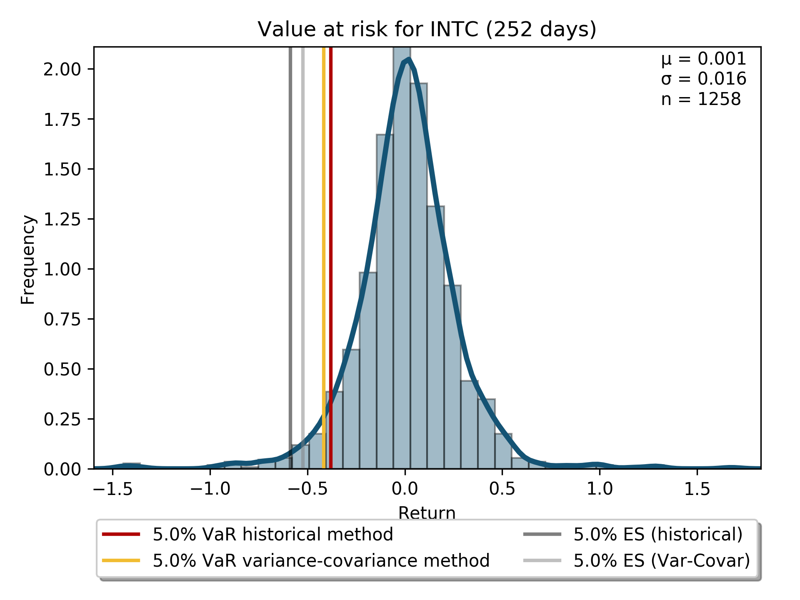

# Value at risk

"VaR.py" allows the user to calculate historical and variance-covariance value at risk and expected shortfall (CVaR). "example.py" integrates the functions provided and allows the user to:

<ul>
<li>select ticker,</li>
<li>select the sample size in years,</li>
<li>select the confidence interval(s),</li>
<li>select the VaR horizon (in trading days),</li>
<li>export the data to csv and</li>
<li>run multiple queries.</li>
</ul>

Furthermore the calculated indicators are visualized.

